<div align="center">


# Madhav E-Commerce Sales Dashboard

### 🚀 Interactive Power BI Analytics for Indian E-Commerce

[](https://powerbi.microsoft.com/)
[](https://opensource.org/licenses/MIT)
[](https://github.com/Abhishek88788/powerbi-dashboard)

</div>

---

## 📊 Dashboard Preview

<div align="center">
  
</div>

---

## 💡 What's Inside?

<table>
<tr>
<td width="25%" align="center">

<br><b>₹438K</b>
<br>Total Sales
</td>
<td width="25%" align="center">

<br><b>₹37K</b>
<br>Total Profit
</td>
<td width="25%" align="center">

<br><b>5,615</b>
<br>Units Sold
</td>
<td width="25%" align="center">

<br><b>₹121K</b>
<br>Avg Order Value
</td>
</tr>
</table>

---

## ✨ Key Features

<div align="center">

| 🗺️ Geographic Analysis | 📅 Time Series | 💳 Payment Insights | 📦 Category Breakdown |
|:---:|:---:|:---:|:---:|
| State-wise sales | Monthly trends | Payment modes | Product categories |

</div>

---

## 📥 Download Resources

<div align="center">

### Get Started Instantly! 👇

<a href="https://github.com/Abhishek88788/powerbi-dashboard/raw/main/Details.csv">
  
</a>

<a href="https://github.com/Abhishek88788/powerbi-dashboard/raw/main/Orders.csv">
  
</a>

<a href="https://github.com/Abhishek88788/powerbi-dashboard/raw/main/dark-gradient.jpg">
  
</a>

</div>

---

## 🎯 Quick Start

```mermaid
graph LR
    A[📥 Clone Repo] --> B[📂 Download CSVs]
    B --> C[🔧 Open Power BI]
    C --> D[📊 Load Data]
    D --> E[✨ Explore Dashboard]
    
    style A fill:#4CAF50,color:#fff
    style B fill:#2196F3,color:#fff
    style C fill:#FF9800,color:#fff
    style D fill:#9C27B0,color:#fff
    style E fill:#F44336,color:#fff
```

<div align="center">



</div>

### Installation

```bash
git clone https://github.com/Abhishek88788/powerbi-dashboard.git
cd powerbi-dashboard
```

---

## 📚 Dataset Overview

<div align="center">

### Details.csv


`Order ID` • `Amount` • `Profit` • `Quantity` • `Category` • `Sub-Category` • `PaymentMode` • `AOV`

### Orders.csv


`Order ID` • `Order Date` • `CustomerName` • `State` • `City`

</div>

---

## 📈 Key Insights

<div align="center">


</div>

| Metric | Insight | 📊 |
|--------|---------|-----|
| **Top State** | Maharashtra leads sales | 🏆 |
| **Best Category** | Clothing (63% volume) | 👕 |
| **Payment Mode** | COD dominates (44%) | 💵 |
| **Top Product** | Printers (highest profit) | 🖨️ |

---

## 🔗 Learn More About Power BI

<div align="center">

<a href="https://learn.microsoft.com/en-us/power-bi/">
  
</a>

<a href="https://powerbi.microsoft.com/en-us/getting-started-with-power-bi/">
  
</a>

<a href="https://learn.microsoft.com/en-us/power-bi/create-reports/">
  
</a>

<a href="https://community.powerbi.com/">
  
</a>

</div>

---

## 🛠️ Built With

<div align="center">


</div>

---

## 📊 Dashboard Components

<div align="center">

| Visualization | Type | Purpose |
|--------------|------|---------|
| 💰 KPI Cards | Metric Display | Track key metrics |
| 📊 Profit Trend | Bar Chart | Monthly analysis |
| 🗺️ State Analysis | Horizontal Bar | Geographic insights |
| 🍩 Category Mix | Donut Chart | Product distribution |
| 💳 Payment Split | Donut Chart | Payment preferences |
| 👥 Top Customers | Bar Chart | Customer ranking |
| 📦 Sub-Category | Horizontal Bar | Detailed breakdown |

</div>

---

## 🎓 Learning Outcomes

<div align="center">

<table>
<tr>
<td align="center" width="50%">

### 📊 Data Modeling
✅ Star schema design<br>
✅ Table relationships<br>
✅ Data transformation

</td>
<td align="center" width="50%">

### 🎨 Visualization
✅ Interactive dashboards<br>
✅ Custom themes<br>
✅ Dynamic filtering

</td>
</tr>
<tr>
<td align="center" width="50%">

### 📐 DAX Measures
✅ KPI calculations<br>
✅ Time intelligence<br>
✅ Aggregations

</td>
<td align="center" width="50%">

### 🔍 Analytics
✅ Trend analysis<br>
✅ Performance metrics<br>
✅ Business insights

</td>
</tr>
</table>

</div>

---

## 📜 License

<div align="center">

This project is licensed under the **MIT License**

<a href="https://github.com/Abhishek88788/powerbi-dashboard/blob/main/LICENSE">
  
</a>

</div>

---

<div align="center">

### ⭐ Star this repository if you find it helpful!


**Made with Power BI & ❤️**

<a href="https://github.com/Abhishek88788/powerbi-dashboard">
  
</a>
<a href="https://github.com/Abhishek88788/powerbi-dashboard/fork">
  
</a>

</div>